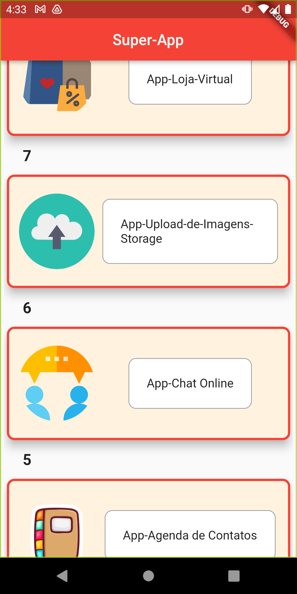
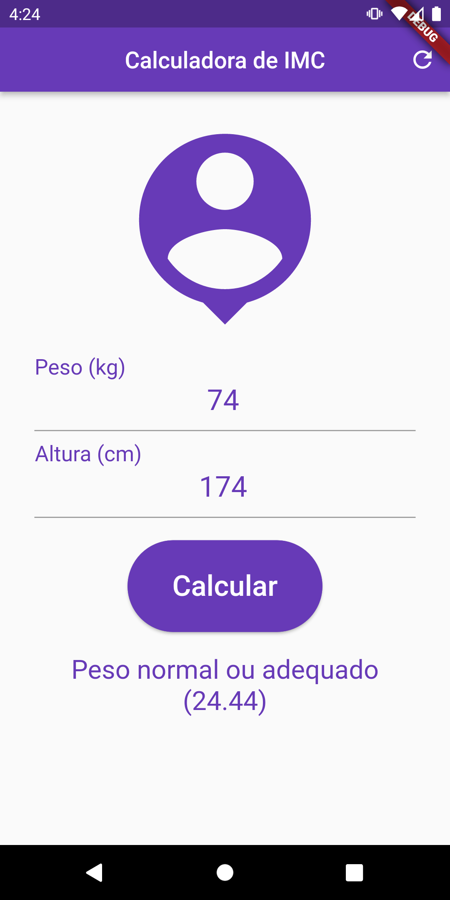
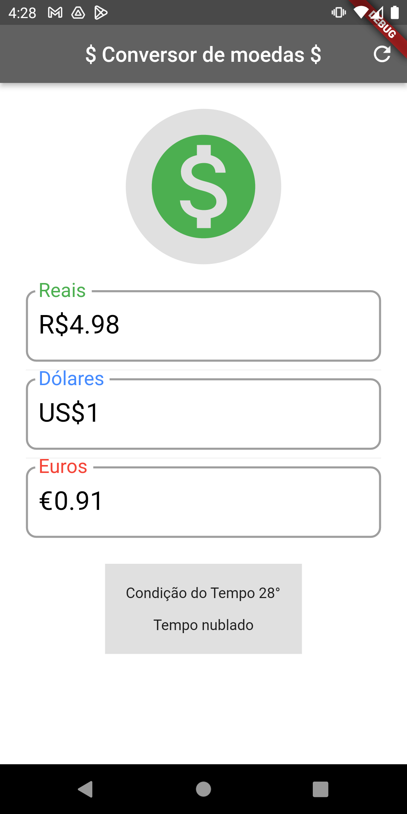
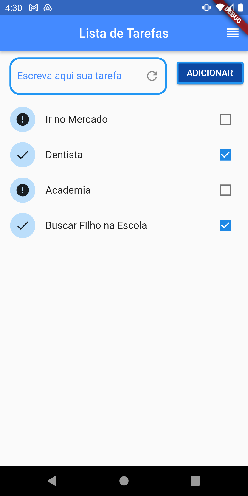
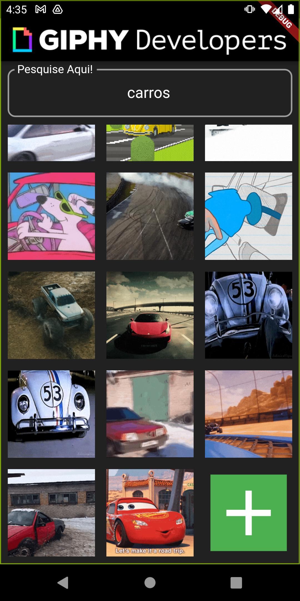
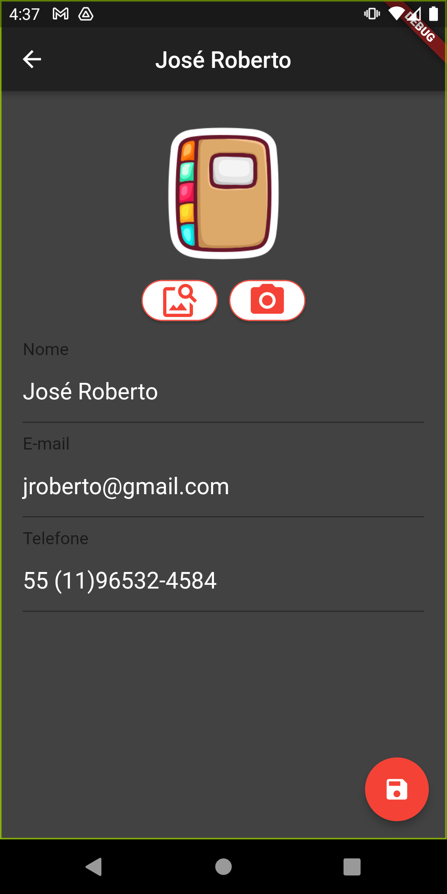
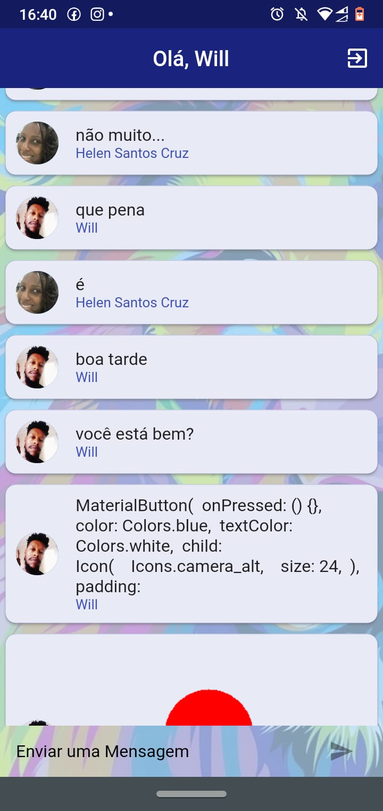
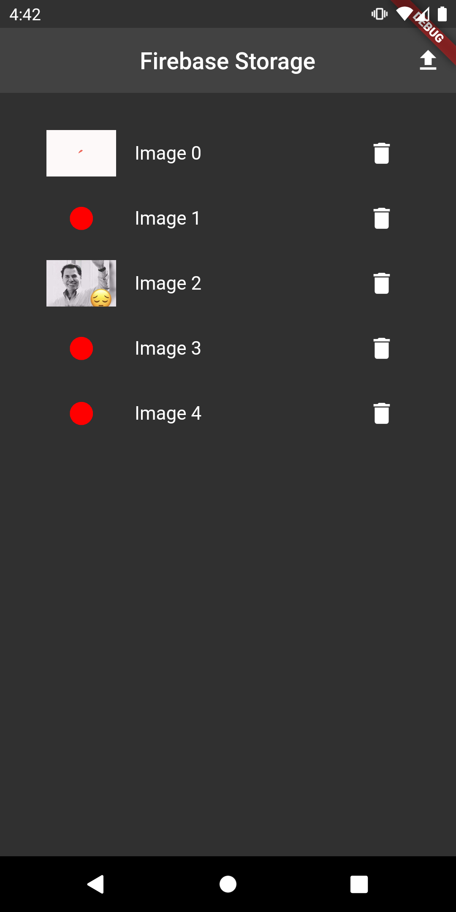
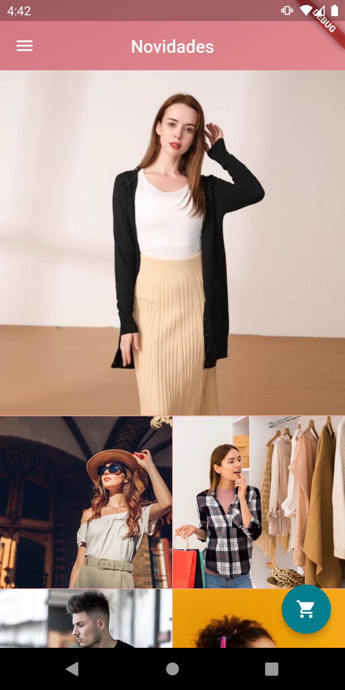

<h1 align="center">Super-App: </h1>
<h1 align="center">
  </h1>

<h1 align="center">
    <a href="https://pub.dev/"> Flutter</a></h1>
	
🚀 Construção de componentes reutilizáveis...

	

</h4>
 <a href="#Descrição">Descrição</a> •
 <a href="#Experiencia">Experiencia</a> •
 <a href="#Features">Features</a> •
 <a href="#Rodar">Rodar</a> • 
 <a href="#Telas">Telas</a> •
 <a href="#Referencias">Referências</a> •  

## Descrição

O SuperApp partiu da ideia de tratar de forma eficiente a aprendizagem durante o curso do Daniel Ciolf sobre flutter onde são desenvolvidos dezenas de apps, ao invez de criar vários do zero agreguei um painel de cards com rotas para cada app  =>
<a href="https://www.startto.dev/">Startto.dev</a>
 

## Experiencia
Achei muito interessante o curso, aborda de forma ampla muitas ferramentas  e tecnicas de desenvolvimento e bases como (instalação, funções, lógica, herança, uso de api, componentização, reaproveitamento de código, arquitetura e muito mais), tudo foi muito bem explorado com ótima metodologia passo a passo, recomendo a todos as aulas do <a href="https://www.startto.dev/">Daniel Ciolf - Startto.dev</a>
### Features
- [x] 1 - App - Indice de massa corporal (utilização de API...)
- [x] 2 - App - Conversor de moédas (utilização de API...)
- [x] 3 - App - Lista de Tarefas
- [x] 4 - App - Buscador de GIFs
- [x] 5 - App - Agenda de Contatos (Banco Firebase - Utilização camera ou Galeria de Imagens...)
- [x] 6 - App - Chat-Online
- [x] 7 - App - Upload de Imagens Firebase
- [x] 8 - App - Loja Virtual

### Rodar
- [x] Fazer Clone do Projeto: git clone https://github.com/willgoncalvescruz/super-app.git
- [x] Acessar diretório: cd super_app
- [x] Baixar dependencias: flutter pub get
- [x] Fazer Build: flutter run / * Para rodar sem null-safety: flutter run --no-sound-null-safety

### Telas
<h1 align="center">

  
  
  
  
  
  
  
  
</h1>

### Referencias
   

      <a href="https://startto.dev">Daniel Ciolf</a>
   
